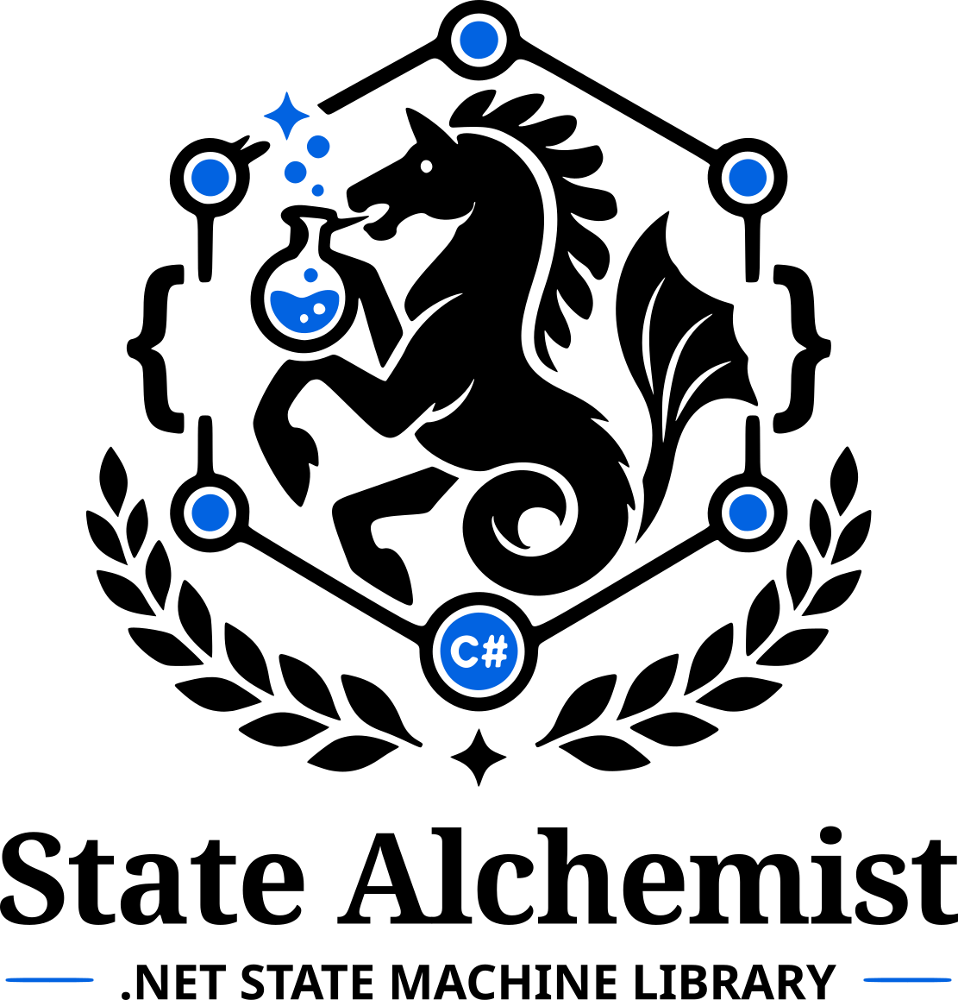

<h1 align="center">
  <picture>
    <source media="(prefers-color-scheme: dark)" srcset="docs/images/StateAlchemist-dark.svg">
    
  </picture>
</h1>

<p align="center">
  <em>"To obtain, something of equal value must be lost."</em><br>
  — Alphonse Elric, <em>Fullmetal Alchemist</em>
</p>

A source-generated hierarchical state machine library for .NET. Your states own their data, your transitions
own the transformation, and the compiler writes the machine.

> **Status: implemented, not released.** The generator, the analyzers, the code fixes and the package are all
> written and tested: 1,077 tests, the whole design, every performance target in the spec. Nothing is on NuGet yet.
>
> - **[Documentation](docs/index.md)** — concepts, guides and reference.
> - **[Roadmap](docs/superpowers/plans/2026-09-11-00-roadmap.md)** — the order of work and how it is tested.
> - **[Design specification](docs/superpowers/specs/2026-09-11-statealchemist-design.md)** — every decision and why.

## Why

State machine libraries such as [Stateless](https://github.com/dotnet-state-machine/stateless) interpret your
configuration at runtime: every trigger is a dictionary lookup and a delegate call, and allocates on the way.
That is affordable for a workflow that fires a few times a minute, and not for a protocol parser on a TCP
connection, where every byte is a trigger.

Measured on .NET 11 RC1 against the shape of [TelnetNegotiationCore](https://github.com/HarryCordewener/TelnetNegotiationCore)'s
state machine:

| | Stateless 5.20 | StateAlchemist |
|---|---|---|
| A negotiation byte | 611 ns, 1,575 B | 20 ns, **0 B** |
| A byte of subnegotiation payload | 282 ns, 1,193 B | a run: 1 KB in 21 ns, **0 B** |
| Building the machine, per connection | 4.4 ms, 2.2 MB | 0.07 µs, one object |

A source generator reads your declarations and emits the machine as straight-line code: a `switch` on the active
state, then on the trigger, calling your transformations directly.

## The idea

**Equivalent exchange.** A transition consumes one state to produce another. Entering a state resets its data;
leaving a state clears it. Nothing survives a transition except what the transition carries across, or what
lives in a state that isn't being left.

- **A state is a type, and it owns its data.** States are structs arranged in a tree. Where data sits in the
  tree is its lifetime: the root's data lives as long as the machine, and a leaf's data lives until you leave it.
- **A transition owns the transformation.** Transitions are declared on their own, not inside states, so a
  plugin can add a transition out of a state it didn't write. A transition's parameters say what it touches.
  The generator checks each one against the tree: a state being left can be read (`in`), a state that stays or
  is being entered can be written (`ref`), and anything else is a compile error.
- **External code is kept separate from state changes.** Transforms are synchronous and pure. Actions (network
  writes, callbacks, logging) run after the state commits, and may be async. One that completes synchronously
  allocates nothing.
- **Async decisions defer without an API for it.** When outside code chooses the outcome (an auth check, an API
  lookup), the machine parks in a generated pending state until it has an answer. `FireAsync` completes once your
  input has been processed, so a `Pipe` read loop stops reading while it waits and the pipe pushes back on the
  sender. Leaving the pending state cancels the decision.

```csharp
public struct SubNegotiation : IState<Connected> { public byte Option; }
[Initial] public struct AwaitingOption : IState<SubNegotiation> { }
public struct Naws : IState<SubNegotiation> { public byte[]? Bytes; public int Index; }

[Module] public static partial class NawsModule
{
    [Transition(From = typeof(AwaitingOption), To = typeof(Naws)), On(31)]
    public static void Begin(in AwaitingOption from, ref SubNegotiation parent, ref Naws to) => parent.Option = 31;

    [Transition(From = typeof(Naws)), OnAny]                       // stay in Naws, capture the byte
    public static void Capture(ref Naws self, byte value)
    { self.Bytes ??= new byte[4]; if (self.Index < 4) { self.Bytes[self.Index] = value; self.Index++; } }
}

// In the application: pick the modules; the generator writes the machine.
[Machine(Root = typeof(Connected), Value = typeof(byte), Context = typeof(TelnetContext))]
[Include(typeof(TelnetCore)), Include(typeof(NawsModule))]
public sealed partial class MudTelnet;
```

## Features

- Hierarchical states whose data is reset on entry and cleared on exit, with no allocation per entry.
- Value triggers (a byte, a `char`, a small enum) matched exactly, by range, or by `OnAny` for whatever a state
  does not otherwise handle; and typed events with their own payload.
- Run transitions: one call takes a whole stretch of input, found by a vectorised scan.
- Async actions and decisions with a synchronous fast path, run-to-completion semantics, and backpressure.
- Compile-time diagnostics for conflicts between plugins, role violations, and uncovered decision outcomes, with
  code fixes for the ones a fix can write.
- A pure *plan* layer (what would this trigger do?), the machine as data, and Mermaid and DOT diagrams as
  constants.
- No reflection: AOT- and trim-clean. Targets `netstandard2.0`, `net8.0`, `net10.0` and `net11.0`.

Adding a protocol is adding a package reference: a library offers its modules with
`[assembly: ExportsModule(typeof(M))]`, and a machine takes them with `[IncludeExported]`.

The first consumer is [TelnetNegotiationCore](https://github.com/HarryCordewener/TelnetNegotiationCore) 4.0; the
[migration design](docs/superpowers/specs/2026-09-11-tnc-4.0-migration-design.md) says how.

## License

[Apache-2.0](LICENSE)
